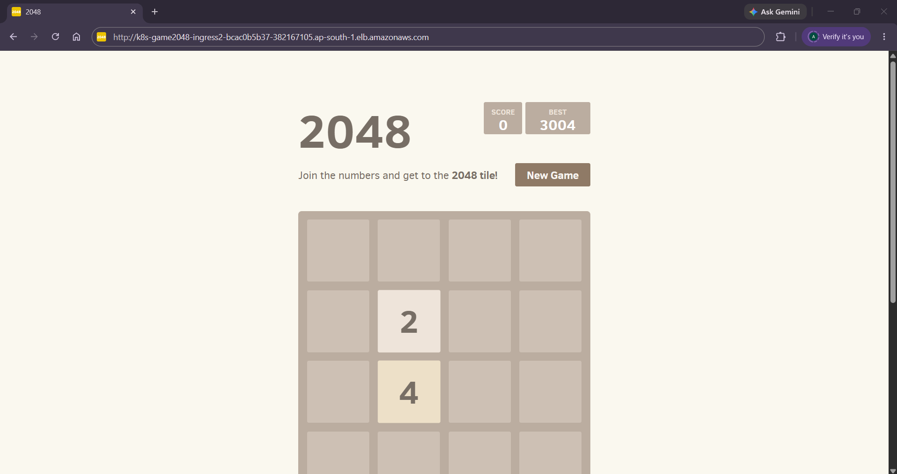

# Kubernetes AWS ALB Ingress - 2048 Game Deployment

A cloud-native DevOps project demonstrating how to deploy containerized applications on **Amazon Elastic Kubernetes Service (EKS)** and expose them externally using the **AWS Load Balancer Controller** and Kubernetes **Ingress** resources with `target-type: ip`.

---

## 🚀 Project Overview
This project sets up a fully functioning Kubernetes Ingress integration with an AWS Application Load Balancer (ALB). Rather than relying on traditional NodePorts, this configuration leverages AWS VPC-native networking to route public internet traffic directly to the private IP addresses of the Kubernetes pods.

---

## 🛠️ Tech Stack & Tools
* **Orchestration:** Amazon EKS (Kubernetes)
* **Traffic Management:** AWS Application Load Balancer (ALB) & AWS Load Balancer Controller
* **Application:** Classic 2048 Game Workload
* **Tooling:** `eksctl`, `kubectl`, AWS CLI, Git, Git Bash

---

## 📸 Application Preview
Here is the deployed 2048 game running successfully on AWS EKS, accessible via the public Application Load Balancer endpoint:



---

## 📂 Repository Structure
```text
kubernetes-aws-alb-ingress/
├── manifests/
│   └── game-2048.yaml      # Namespace, Deployment, Service, and Ingress manifests
├── images/
│   └── app.png             # Application screenshot
└── README.md
